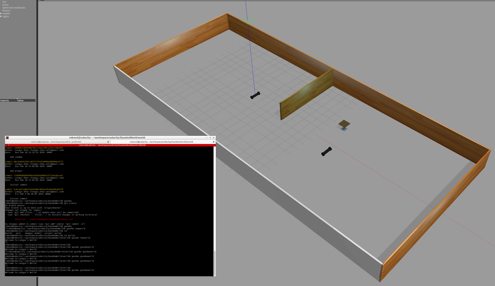

# GazeboWorld

[](https://www.udacity.com/robotics)

# RoboND-myrobot
The **myrobot** lab part of RoboND Gazebo Basics lesson. The purpose of this lab is to learn how to build a two-wheeled robot model with the Model Editor tool in Gazebo. Include this model in an empty Gazebo World. And, finally write a plugin to interact with this world.  

### Directory Structure
```
    .myrobot                           # myrobot lab main folder 
    ├── images                         # Code output image                   
    │   ├── generate_world.png
    ├── model                          # Model files of the two-wheeled robot
    │   ├── twowheelsrobotModel
    │   │   ├── model.config
    │   │   ├── model.sdf
    │   ├── wall
    │   │   ├── model.config
    │   │   ├── model.sdf
    ├── script                         # Gazebo World plugin C++ script      
    │   ├── hello.cpp
    ├── world                          # Gazebo main World empty scene
    │   ├── gazeboworld
    ├── CMakeLists.txt                 # Link libraries 
    └──                              
```

### Steps to launch the simulation

#### Step 1 Update and upgrade the Workspace image
```sh
$ sudo apt-get update
$ sudo apt-get upgrade -y
```

#### Step 2 Create the robot model with model editor and building (wall) with building editor. Note that after creating these model, need to add the path to .bashrc.
```sh
$ gedit ~/.bashrc
```

Add the following:
```sh
$ export GAZEBO_MODEL_PATH=/home/robond/workspace/udacity/GazeboWorld/model:$GAZEBO_MODEL_PATH
```

At the end, save the world file as `gazeboworld` in the world folder.

#### Step 3 Compile the code

After adding the `hello.cpp` into script folder, creating the CMakeList file and adding the plugin source code into world file, compile the code.

```sh
$ cd /home/robond/workspace/udacity/GazeboWorld
$ mkdir build
$ cd build/
$ cmake ../
$ make
```

#### Step 4 Add the library path to the Gazebo plugin path  
```sh
$ export GAZEBO_PLUGIN_PATH=${GAZEBO_PLUGIN_PATH}:/home/robond/workspace/udacity/GazeboWorld/build
```

#### Step 5 Run the Gazebo World file  
```sh
$ cd /home/robond/workspace/udacity/GazeboWorld/world
$ gazebo newworld
```

### Output
The hello world message and the two-wheeled robot inside a Gazebo World should both launch as follow: 
